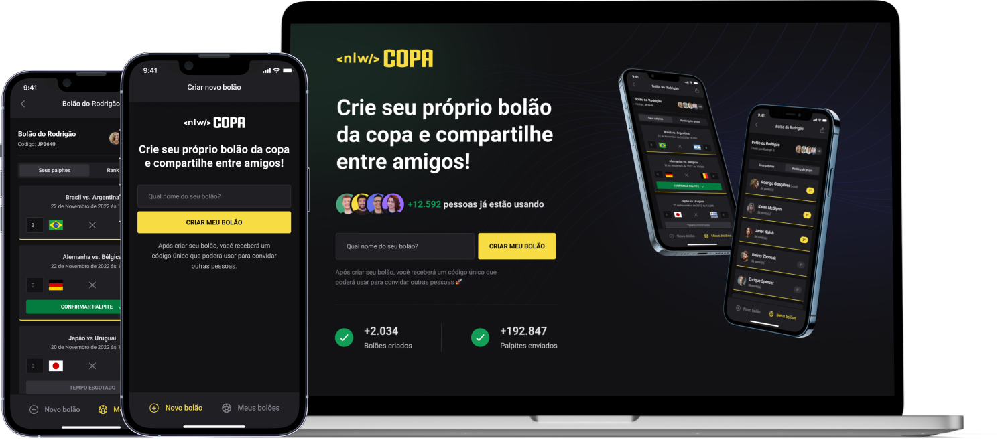

    <h1 align="center">
        
         

<a aria-label="Completed" href="https://rocketseat.com.br/">
    </img>
</a>

    </h1>

 

  <a href="#speech_balloon-Sobre">About</a>&nbsp;&nbsp;&nbsp;|&nbsp;&nbsp;&nbsp;
  <a href="#camera-Preview">Preview</a>&nbsp;&nbsp;&nbsp;|&nbsp;&nbsp;&nbsp;
  <a href="#rocket-Tecnologias">Technologies</a>

## :speech_balloon: About

This application was developed during the NLW event of [Rocketseat](https://www.rocketseat.com.br/ignite).

The **`<nlw/> COPA`** is an application where we can create "pools" to make predictions for the 2022 soccer world cup games.
The application has a web interface made in React (only for creating pools), a back-end developed in Node.js and a mobile App made in React Native.

## :camera: Preview

  

## :rocket: Technologies

- [ReactJS](https://reactjs.org/)
- [React Native](https://reactnative.dev/)
- [Node.js](https://nodejs.org/en/docs/)
- [TypeScript](https://www.typescriptlang.org/)
- [Expo](https://expo.dev/)
- [Prisma ORM](https://www.prisma.io/)
- [NativeBase](https://nativebase.io/)
- [Tailwind CSS](https://tailwindcss.com/)
- [Fastify](https://www.fastify.io/)
- [Zod](https://github.com/colinhacks/zod)

  Feito com :purple_heart:

